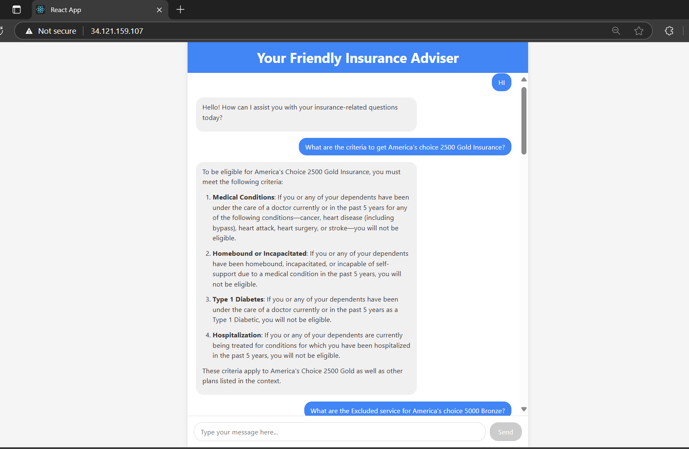
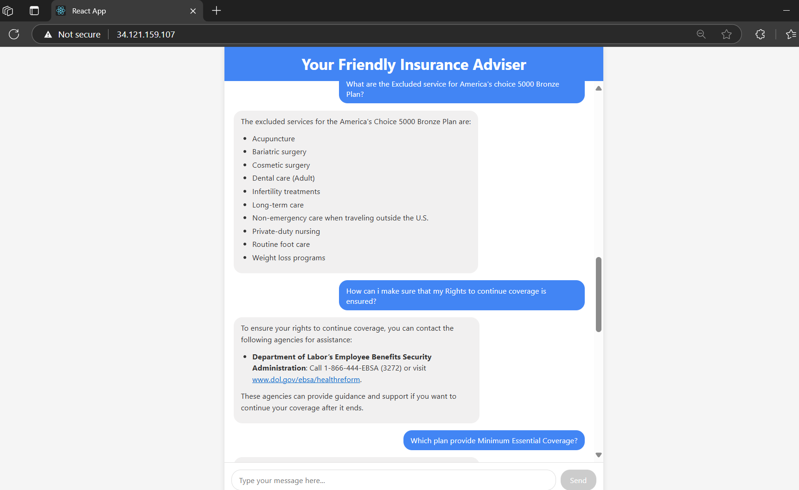

# Project Title

## Overview

This project is a FastAPI-based backend application designed to support chat and document upload APIs using `AzureOpenAI` `GPT-4o` Model and `AzureOpenAIEmbeddings (text-embedding-ada-002)` for language processing and `Milvus (ZilliZ)` for vector storage.

The project structure is:


```
src/
├── app/
│   ├── api/
│   │   ├── core/            # Chat and document upload APIs
│   │   ├── monitoring/      # Monitoring endpoints
│   ├── application.py       # FastAPI app initialization
│   ├── config.py             # Settings class for environment variables
│
├── llms/                    # AzureOpenAI integration (extendable to other LLMs)
│
├── prompts/
│   ├── prompt.py             # Contains system_prompt and user_prompt templates
│
├── vectorstore/
    ├── milvus_connect.py     # Milvus vectorstore connection and operations

```

## Directories and Core Components

### 1. `app/`
- **application.py**: Initializes and configures the FastAPI application.
- **config.py**: Loads and manages environment variables from a `.env` file.
- **api/**
  - **core/**: 
    - `chat` API: Handles chat interactions.
    - `upload document` API: Handles document uploads, chunking, and preparation for embedding.
  - **monitoring/**: APIs for application health and status.

### 2. `llms/`
- Contains code related to Azure OpenAI.  
- Easily extendable to integrate other LLM providers.

### 3. `prompts/`
- **prompt.py**:
  - `prompt_dict` contains:
    - `system_prompt`: Parameterized template, dynamically filled with context.
    - `user_prompt`: Accepts the user's question at runtime.

### 4. `vectorstore/`
- **milvus_connect.py**: 
  - Connects to Milvus.
  - Handles file chunking, embeddings generation, and vector insertion into the database.

## Required Environment Variables

To run this project, ensure the following environment variables are set:

| Variable | Description |
|:---|:---|
| `ZILLIS_ENDPOINT` | The endpoint URL of the Milvus (Zilliz) vectorstore. |
| `ZILLIS_TOKEN` | Access token for authenticating with Zilliz. |
| `ZILLIS_COLLECTION_NAME` | The name of the collection in Milvus where embeddings will be stored. |
| `AZURE_OPENAI_EMBEDDING_DEPLOYMENT` | The deployment name for the Azure OpenAI embedding model. |
| `AZURE_OPENAI_API_KEY` | API key for Azure OpenAI services. |
| `AZURE_OPENAI_ENDPOINT` | Endpoint URL for the Azure OpenAI service. |
| `AZURE_OPENAI_API_VERSION` | API version for Azure OpenAI service. |
| `AZURE_OPENAI_API_TYPE` | API type (usually "openai" for Azure OpenAI). |
| `AZURE_OPENAI_LLM_KEY` | Key specifically used for LLM operations (can be the same as API Key). |
| `AZURE_OPENAI_LLM_ENDPOINT` | Endpoint URL specifically used for LLM operations. |


# Project Setup Guide

## How to Run

### 1. Clone the repository
```bash
git clone <your-repository-url>
cd <your-project-directory>
```

### 2. Create and activate a virtual environment

**Windows**
```bash
python -m venv .venv
.venv\Scripts\activate
```

**Linux / macOS**
```bash
python3 -m venv .venv
source .venv/bin/activate
```

### 3. Install the dependencies
```bash
pip install -r requirements.txt
```

### 4. Start the server
```bash
uvicorn src.app.application:app --host 127.0.0.1 --port 4000 --proxy-headers
```

### 5. Access the API documentation
Once the server is running, you can view the Swagger API documentation at:
```
http://localhost:4000/api/docs
```

## Live Backend

The backend is hosted on GCP's Cloud Run:

```
https://custom-fastapi-service-333008071293.us-central1.run.app
```

To access the Swagger API documentation for the live backend, visit:

```
https://custom-fastapi-service-333008071293.us-central1.run.app/api/docs
```




